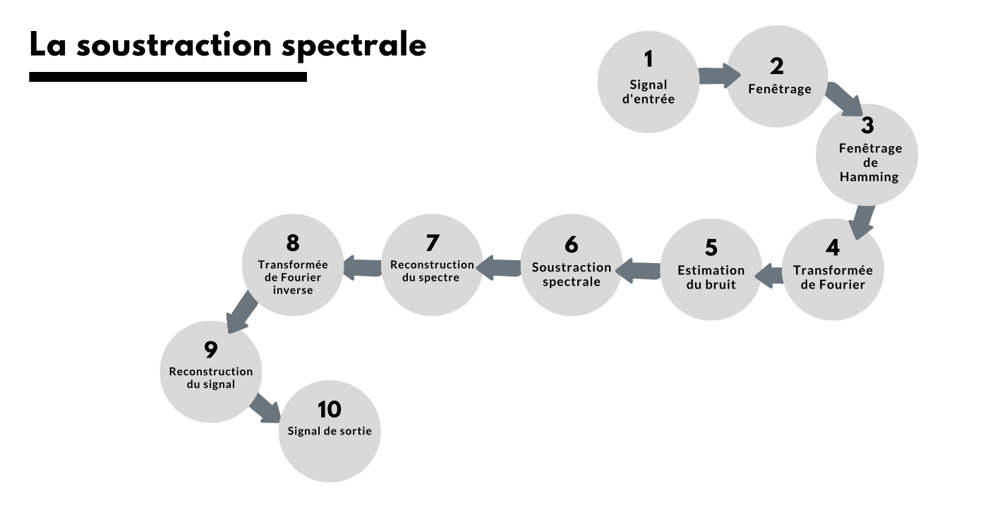
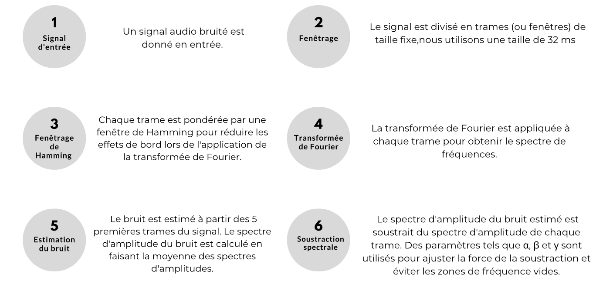
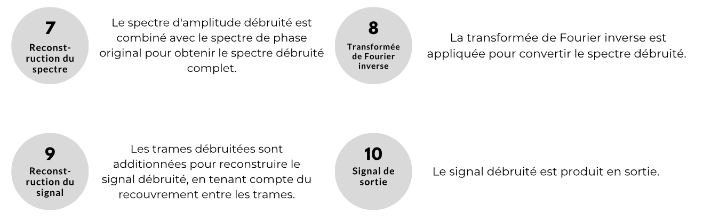
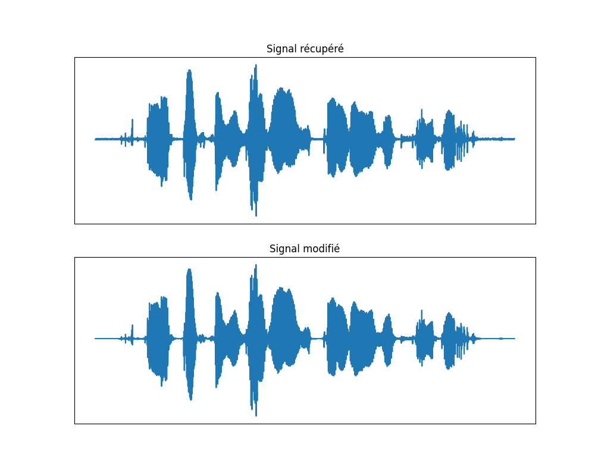
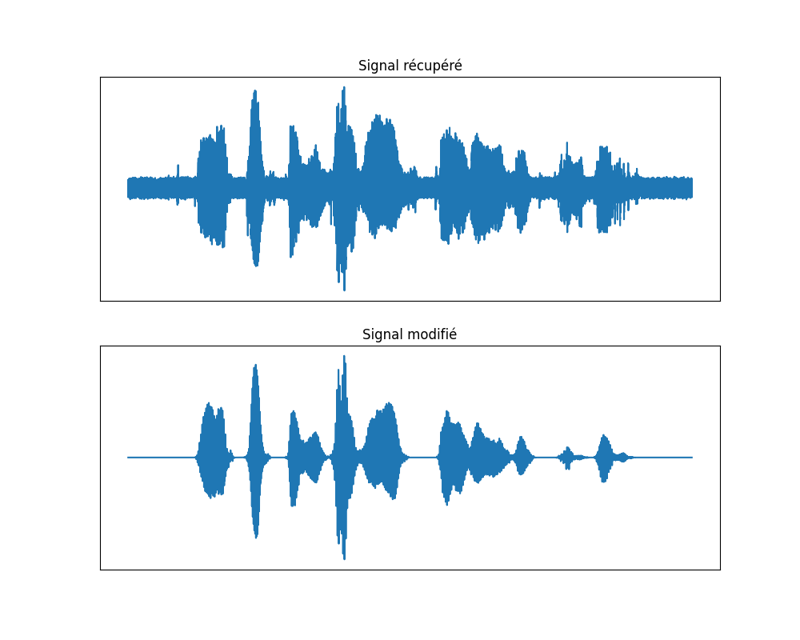

# 
Rapport Projet Parole

## 
Débruitage de la parole (Fourier, Soustraction spectrale)

### 
Hugo MATHIEU STEINBACH & Guillaume ZIMOL

## Fonctionnement du programme

Pour exécuter le programme un simple python3 main.py <nom_fichier.wav> suffit. 
Il faut cependant avoir au-préalable exécuter les commandes suivantes : 
- pip install numpy
- pip install matplotlib
- pip install scipy

Ainsi, le programme va lire le fichier audio et le débruiter en utilisant la méthode de Fourier ou de soustraction spectrale. 
Le programme va ensuite enregistrer le fichier ébruité sous le nom "resultat_<nom_fichier.wav>". 
Il génère également des diagrammes dans le dossier "Diagrammes" pour visualiser les résultats, du spectre d'amplitude et du signal initial et modifié. 
Les 3 exécutions possibles avec les fichiers fournis sont les suivantes : 
- python3 main.py test_seg.wav
- python3 main.py test_seg_bruit_0dB.wav
- python3 main.py test_seg_bruit_10dB.wav

Si l'on veut tester différentes valeurs pour alpha, beta ou gamma, il suffit de modifier les variables de la fonction `spectreAmplitudeDebruitage` dans le fichier main.py. 
Les fichiers (diagrammes et résultats) actuellement présents dans le dossier "Diagrammes" sont ceux obtenus avec les meilleurs paramètres obtenus via les différents tests. 

## Schéma présentant les différentes étapes de la soustraction spectrale

Voici un schéma présentant les différentes étapes de la soustraction spectrale : 

## Présentation de différents tests

### Test 1 : Débruitage de la parole sans bruit

Pour ce premier test, nous avons utilisé le fichier "test_seg.wav" qui est un fichier audio de parole sans bruit. 
Peu-importe les valeurs pour alpha, beta ou gamma, le résultat est similaire. 
C'est normal puisque le signal n'est pas bruité. 
Ainsi la méthode de soustraction spectrale n'a pas de réel effet sur le signal. 

Voici le résultat, ici avec alpha = 1, beta = 10 et gamma = 0 : 

### Test 2 : Débruitage de la parole avec bruit 0dB

Pour ce deuxième test, nous avons utilisé le fichier "test_seg_bruit_0dB.wav" qui est un fichier audio de parole avec un bruit de 0dB. 
Nous avons testé différentes valeurs pour alpha, beta et gamma. 
Le meilleur résultat est obtenu avec alpha = 1, beta = 20 et gamma = 0. 
Voici le résultat : 

### Test 3 : Débruitage de la parole avec bruit 10dB

Pour ce troisième test, nous avons utilisé le fichier "test_seg_bruit_10dB.wav" qui est un fichier audio de parole avec un bruit de 10dB. 
Nous avons également testé différentes valeurs pour alpha, beta et gamma. 
Le meilleur résultat est obtenu avec alpha = 1, beta = 10 et gamma = 0. 
Voici le résultat : 

### Conclusion sur les tests

Nous remarquons, que l'on distingue sur chaque signal résultat sur les fichiers .wav avec bruit, un "pic de bruit" au début des signaux effectivement, on utilise les 5 premières fenêtre pour le calcul de la moyenne du bruit, et nous ne retirons donc pas ce bruit sur les 160 premières millisecondes (32ms*5). 
Pour une conclusion globale, le débruitage de la parole est plus facile avec un bruit de 10dB que celui avec un bruit de 0dB. 
La valeur de alpha la plus efficace dans tous les cas est 1. 
La valeur de beta permet de retirer "plus de bruit", mais elle peut aussi retirer du signal vocal, ce qui est moins souhaitable. 
Pour la valeur de gamma seuls des valeurs très faible entre 0 et 0.2 donne de bons résultats, au-delà le bruit résiduel est amplifié. 